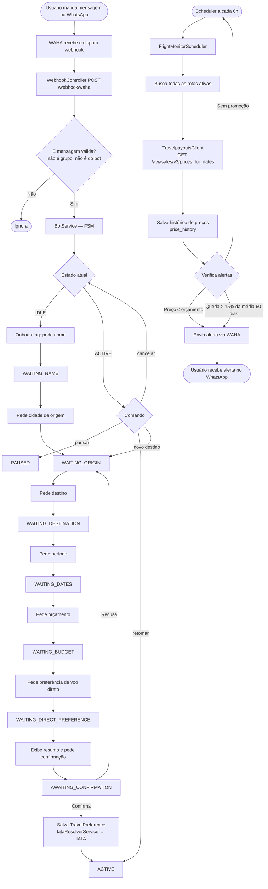
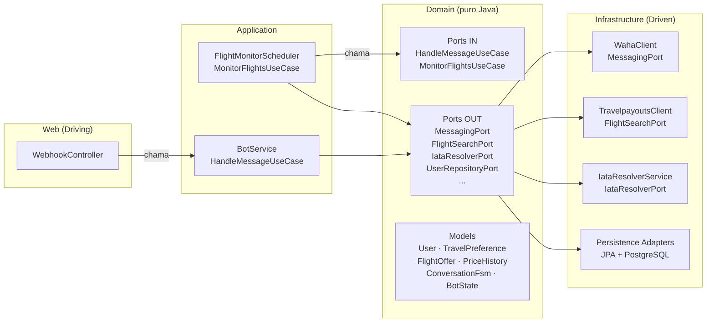

# trip.ai

Bot de WhatsApp que monitora passagens aéreas e envia alertas automáticos quando encontra promoções. Você cadastra a rota, o orçamento e o período — o sistema verifica a cada 6 horas e avisa quando o preço abaixa.

---

## Como funciona



---

## Arquitetura

O projeto segue **arquitetura hexagonal (Ports & Adapters)**. O domínio não conhece nenhum framework — Spring, JPA e WebClient ficam exclusivamente na camada de infraestrutura.



### Estrutura de pacotes

```
src/main/java/com/trip_ai/
├── TripAiApplication.java
├── domain/
│   ├── model/                  # Entidades de domínio (Java puro, sem anotações JPA)
│   │   ├── User.java
│   │   ├── TravelPreference.java
│   │   ├── ConversationFsm.java
│   │   ├── FlightOffer.java
│   │   ├── PriceHistory.java
│   │   └── PriceAlert.java
│   ├── enums/
│   │   └── BotState.java       # FSM: IDLE → … → ACTIVE ↔ PAUSED
│   └── port/
│       ├── in/                 # Casos de uso (driving ports)
│       └── out/                # Interfaces de saída (driven ports)
├── app/
│   ├── BotService.java         # FSM da conversa — implementa HandleMessageUseCase
│   └── FlightMonitorScheduler.java  # Job agendado — implementa MonitorFlightsUseCase
├── infra/
│   ├── waha/                   # Adapter WAHA (WhatsApp HTTP API)
│   │   ├── WahaClient.java
│   │   └── dto/WahaWebhookEvent.java
│   ├── travelpayouts/          # Adapter Travelpayouts Data API
│   │   └── TravelpayoutsClient.java
│   ├── claude/                 # Adapter Anthropic Claude (resolução IATA)
│   │   └── IataResolverService.java
│   ├── persistence/            # Adapters JPA (entities + repositories + adapters)
│   │   ├── entity/
│   │   ├── repository/
│   │   └── adapter/
│   └── config/
│       └── WebClientConfig.java
└── web/
    └── WebhookController.java  # POST /webhook/waha
```

---

## Stack

| Camada | Tecnologia |
|--------|------------|
| Runtime | Java 21 + Spring Boot 3.2 |
| Banco de dados | PostgreSQL 15 |
| Migrations | Flyway |
| Gateway WhatsApp | [WAHA](https://waha.devlike.pro) — NOWEB engine (gratuito) |
| API de voos | [Travelpayouts Data API](https://travelpayouts.github.io/slate/) |
| Resolução IATA | Claude API (Anthropic) com fallback em mapa local |
| HTTP clients | Spring WebFlux WebClient (reativo, fire-and-forget) |
| Infra local | Docker Compose |
| Deploy | Railway (monolito) |

---

## Pré-requisitos

- Docker + Docker Compose
- Java 21 (recomendado: [Temurin](https://adoptium.net))
- Maven 3.9+ (ou usar o wrapper `./mvnw`)
- Conta no [Travelpayouts](https://travelpayouts.com) (afiliado, gratuito)
- Chave da [Anthropic API](https://console.anthropic.com) (opcional — fallback local cobre ~130 cidades)

---

## Setup local

### 1. Clonar e configurar variáveis de ambiente

```bash
cp .env.example .env
```

Preencha o `.env` com suas credenciais (nunca commitar):

```env
TRAVELPAYOUTS_TOKEN=seu-token-aqui
TRAVELPAYOUTS_MARKER=seu-marker-aqui   # deixe vazio em dev
CLAUDE_API_KEY=sk-ant-...              # opcional
```

### 2. Subir a infraestrutura

```bash
docker compose up -d
```

Isso inicia:
- **PostgreSQL** na porta `5432` (banco `tripai`)
- **WAHA** na porta `3000` (NOWEB engine — sem Redis, sem Baileys)

### 3. Conectar o WhatsApp

Acesse `http://localhost:3000` no browser.

Você verá a interface do WAHA. A sessão `default` é iniciada automaticamente. Para escanear o QR code:

```bash
curl http://localhost:3000/api/screenshot?session=default \
  -H "X-Api-Key: tripai-local-key" --output qr.png && open qr.png
```

Ou acesse `http://localhost:3000/api/screenshot?session=default` no browser.

### 4. Rodar o backend

```bash
./mvnw spring-boot:run
```

O servidor sobe na porta `8081`. O Flyway aplica as migrations automaticamente na inicialização.

### 5. Testar o fluxo

Envie "oi" para o número conectado no WhatsApp. O bot inicia o onboarding:

```
trip.ai: Olá! 👋 Sou o trip.ai. Para começar, qual é o seu nome?
você:    Gabriel
trip.ai: Prazer, Gabriel! De qual cidade você vai partir?
...
```

Ou simule via curl:

```bash
curl -X POST http://localhost:8081/webhook/waha \
  -H "Content-Type: application/json" \
  -d '{
    "event": "message",
    "session": "default",
    "payload": {
      "from": "55119XXXXXXXX@c.us",
      "fromMe": false,
      "body": "oi",
      "notifyName": "Teste"
    }
  }'
```

> Substitua `55119XXXXXXXX` pelo seu DDD + número real para receber a resposta no WhatsApp.

---

## Regras de alerta

O scheduler roda a cada 6 horas e dispara alerta ao usuário quando qualquer condição é atendida:

| Regra | Condição |
|-------|----------|
| Orçamento | Preço encontrado ≤ orçamento cadastrado pelo usuário |
| Histórico | Queda > 15% em relação à média dos últimos 60 dias |

O alerta inclui companhia aérea, data de partida, número de escalas e link de afiliado para reserva direta no Aviasales.

---

## Configuração de referência

```yaml
# application.yml — valores sensíveis devem vir de variáveis de ambiente
tripai:
  waha:
    url: http://localhost:3000
    api-key: tripai-local-key
    session: default
  travelpayouts:
    token: ${TRAVELPAYOUTS_TOKEN}
    base-url: https://api.travelpayouts.com
    marker: ${TRAVELPAYOUTS_MARKER:}
  claude:
    api-key: ${CLAUDE_API_KEY}
    model: claude-haiku-4-5
  scheduler:
    cron: "0 0 */6 * * *"    # para testar: "0 */2 * * * *" (a cada 2 min)
  alert:
    min-drop-percentage: 15.0
```
